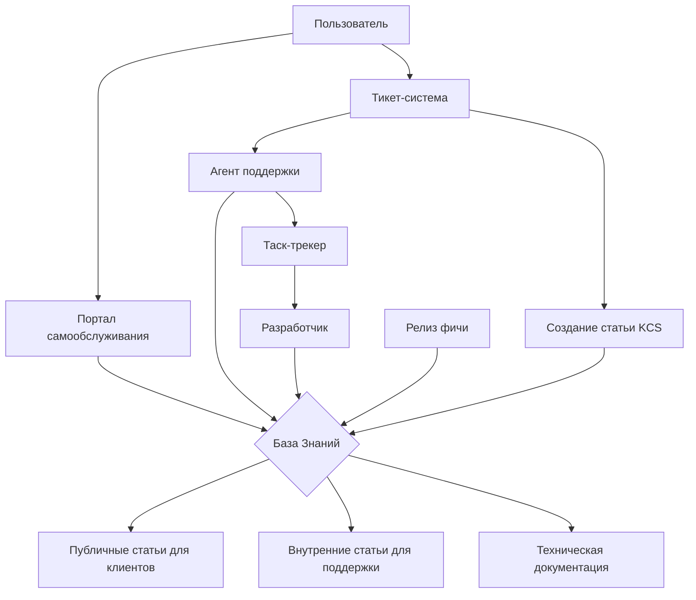

# База знаний

```mermaid
graph TD
    A[Пользователь] --> B[Портал самообслуживания]
    B --> C{База Знаний}
    C --> D[Публичные статьи для клиентов]

    A --> E[Тикет-система]
    E --> F[Агент поддержки]
    F --> C
    C --> G[Внутренние статьи для поддержки]

    F --> H[Таск-трекер]
    H --> I[Разработчик]
    I --> C
    C --> J[Техническая документация]

    K[Релиз фичи] --> C
    E --> L[Создание статьи KCS]
    L --> C
```
